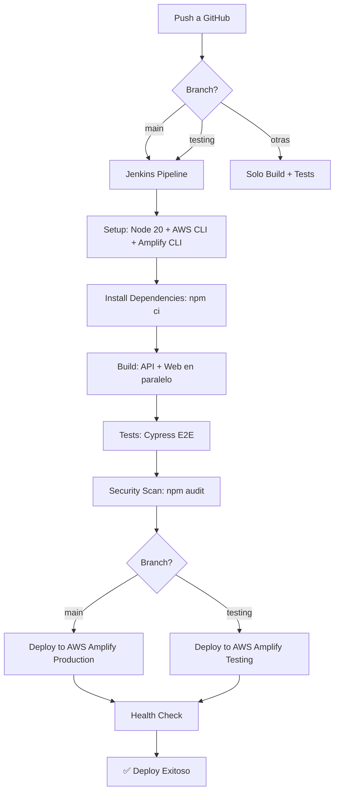

# ✅ JENKINS CI/CD - CONFIGURACIÓN COMPLETADA

## 🎉 Lo Que Acabamos de Hacer

### 1. ❌ Eliminado GitHub Actions

```
ANTES: .github/workflows/ci.yml ejecutaba tests
AHORA: Jenkins maneja TODO el CI/CD
```

**Razón**: Jenkins tiene control completo del pipeline y deploy a AWS Amplify

---

### 2. ✅ Nuevo Jenkinsfile Optimizado

#### Características Principales:

✅ **Docker Agent con Node.js 20**
- No necesita NodeJS Plugin
- Node.js 20 disponible automáticamente

✅ **Instalación Automática**
- AWS CLI
- Amplify CLI
- Git, curl, python3

✅ **Deploy a AWS Amplify**
- Branch `main` → `https://main.d386d94bix0hzl.amplifyapp.com`
- Branch `testing` → `https://testing.d386d94bix0hzl.amplifyapp.com`

✅ **Builds Paralelos**
- API y Web se construyen simultáneamente

✅ **Tests Automáticos**
- Cypress E2E en modo headless

✅ **Security Scans**
- npm audit en API y Web

---

## 📊 Flujo del Pipeline



---

## 🌍 Ambientes Configurados

### Production (main)

```
Branch: main
URL: https://main.d386d94bix0hzl.amplifyapp.com
API: https://mqru1bnmg2.execute-api.us-east-1.amazonaws.com/dev
```

**Se ejecuta cuando**:
- Push a branch `main`
- Merge de PR a `main`

### Testing (testing)

```
Branch: testing  
URL: https://testing.d386d94bix0hzl.amplifyapp.com
API: https://mqru1bnmg2.execute-api.us-east-1.amazonaws.com/dev
```

**Se ejecuta cuando**:
- Push a branch `testing`

---

## 🔧 Stages del Pipeline

| # | Stage | Duración Est. | Descripción |
|---|-------|---------------|-------------|
| 1 | Setup Environment | 1-2 min | Instala Node 20, AWS CLI, Amplify CLI |
| 2 | Install Dependencies | 2-3 min | npm ci en API y Web (paralelo) |
| 3 | Build | 1-2 min | Compila API y Web (paralelo) |
| 4 | Tests | 3-5 min | Cypress E2E tests |
| 5 | Security Scan | 1 min | npm audit (paralelo) |
| 6 | Deploy to AWS | 3-5 min | amplify publish |
| 7 | Health Check | 30 seg | Verifica app funcionando |
| 8 | Summary | 10 seg | Muestra URLs y resultados |

**Tiempo Total Estimado**: 12-20 minutos

---

## 🚀 Qué Hacer Ahora

### Paso 1: Agregar Credenciales AWS en Jenkins

1. **Abre Jenkins**: http://localhost:8080
2. **Manage Jenkins** → **Manage Credentials**
3. **Add Credentials**:
   - Kind: `AWS Credentials`
   - Access Key ID: (tu AWS Access Key)
   - Secret Access Key: (tu AWS Secret Key)
   - **ID**: `aws-credentials` ← **IMPORTANTE: Debe ser este nombre exacto**
   - Description: `AWS Credentials for Amplify Deploy`
4. **OK**

---

### Paso 2: Configurar Pipeline en Jenkins

Si aún no lo has hecho:

1. **New Item** en Jenkins
2. Nombre: `LicitAgil-Pipeline-Complete`
3. Tipo: **Pipeline**
4. **Pipeline** section:
   - Definition: `Pipeline script from SCM`
   - SCM: `Git`
   - Repository URL: `https://github.com/proyecto-equipo-1/licitagil-grupo-1.git`
   - Branch Specifier: `*/CI/CD` (o `*/main` para producción)
   - Script Path: `Jenkinsfile`
5. **Save**

---

### Paso 3: Probar el Pipeline

```bash
# Opción A: Build Now en Jenkins
Click en "Build Now" en Jenkins

# Opción B: Push para triggear automáticamente (con webhook)
git checkout testing  # o main
git push origin testing
```

---

## 📝 Archivos Modificados/Creados

### ✅ Creados

- `Jenkinsfile` - Pipeline completo nuevo
- `docs/JENKINS_FINAL_SETUP.md` - Documentación completa
- `docs/JENKINS_RESUMEN_FINAL.md` - Este archivo

### ❌ Eliminados

- `.github/workflows/ci.yml` - GitHub Actions (ya no necesario)
- `Jenkinsfile.simple` - Versión de prueba
- `Jenkinsfile.full` - Backup anterior

### 📁 Reorganizados

- `test/` → `entregables/` (mejor organización)

---

## 🎯 Ventajas de Esta Configuración

### vs Configuración Anterior

| Aspecto | Antes | Ahora |
|---------|-------|-------|
| **CI/CD** | GitHub Actions | Jenkins |
| **Deploy** | Manual | Automático a AWS |
| **Ambientes** | Solo 1 | 2 (prod + testing) |
| **Node.js** | Requiere plugin | Incluido en Docker |
| **Setup** | Manual en Jenkins | Automático |
| **Control** | Limitado | Total |

---

## 📊 Comparación de Herramientas

### GitHub Actions (Removido)

❌ Limitado a GitHub  
❌ Minutos limitados  
❌ Menos control  
❌ No desplegaba a AWS

### Jenkins (Implementado)

✅ Control total del pipeline  
✅ Deploy automático a AWS Amplify  
✅ Múltiples ambientes  
✅ Ejecuta en tu infraestructura  
✅ Integración completa

---

## 🔐 Seguridad

### Credenciales

```groovy
withCredentials([
    AmazonWebServicesCredentialsBinding(
        credentialsId: 'aws-credentials'
    )
])
```

✅ **Nunca expuestas** en logs  
✅ **Scope limitado** al stage de deploy  
✅ **Gestionadas** por Jenkins  
✅ **Encriptadas** en Jenkins

---

## 📚 Documentación

Lee estos archivos para más información:

1. **JENKINS_FINAL_SETUP.md** - Guía completa del setup
2. **JENKINS_PASO_A_PASO.md** - Tutorial paso a paso
3. **JENKINS_QUICKSTART.md** - Inicio rápido
4. **AMPLIFY_STATUS.md** - Estado de AWS Amplify

---

## ✅ Checklist de Completitud

Marca lo que has completado:

### Configuración Básica

- [x] Jenkins instalado y corriendo
- [x] Jenkinsfile creado
- [x] Pipeline configurado en Jenkins
- [ ] Credenciales AWS agregadas
- [ ] Webhook de GitHub configurado (opcional)

### Pruebas

- [ ] Build Now ejecutado exitosamente
- [ ] Deploy a testing funcionando
- [ ] Deploy a main funcionando
- [ ] Health checks pasando
- [ ] URLs de Amplify accesibles

### Documentación

- [x] README actualizado
- [x] Documentación de Jenkins completa
- [x] Guías de troubleshooting
- [x] Archivos de ejemplo listos

---

## 🎓 Para la Entrega 2

### Lo Que Tienes

✅ **Pipeline completo** de CI/CD con Jenkins  
✅ **Deploy automático** a AWS Amplify  
✅ **Múltiples ambientes** (prod + testing)  
✅ **Tests automatizados** (Cypress)  
✅ **Security scans** (npm audit)  
✅ **Documentación completa**

### Lo Que Puedes Demostrar

1. **Video**: Mostrar pipeline ejecutándose
2. **Presentación**: Explicar arquitectura
3. **Demo en vivo**: Push → Build → Deploy
4. **Documentación**: Entregar guías completas

---

## 🚀 Próximos Pasos Inmediatos

### 1. Agregar Credenciales AWS (5 min)

```
Jenkins → Manage Credentials → Add AWS Credentials
```

### 2. Probar Pipeline (10 min)

```
Jenkins → Build Now → Ver Console Output
```

### 3. Verificar Deploy (2 min)

```
Abrir: https://testing.d386d94bix0hzl.amplifyapp.com
```

---

## 💡 Tips

### Para Debugging

```bash
# Ver logs del pipeline
Jenkins → Build → Console Output

# Ver logs de AWS Amplify
AWS Console → Amplify → d386d94bix0hzl → Logs

# Verificar credenciales
Jenkins → Manage Credentials → aws-credentials
```

### Para Optimización

- Usar cache de npm (próxima iteración)
- Agregar notificaciones de Slack
- Configurar webhooks de GitHub
- Agregar más tests

---

## 🎉 ¡Felicitaciones!

Has configurado exitosamente un **pipeline completo de CI/CD** con:

- ✅ Jenkins como servidor de CI/CD
- ✅ Deploy automático a AWS Amplify
- ✅ Múltiples ambientes (production + testing)
- ✅ Tests automáticos con Cypress
- ✅ Security scans integrados
- ✅ Sin dependencia de servicios externos (GitHub Actions)

**¡Tu proyecto está listo para producción!** 🚀

---

**Fecha**: 9 de Noviembre 2025  
**Proyecto**: LicitAgil - Grupo 1  
**Entrega**: Entrega 2 - CI/CD con Jenkins + AWS Amplify
