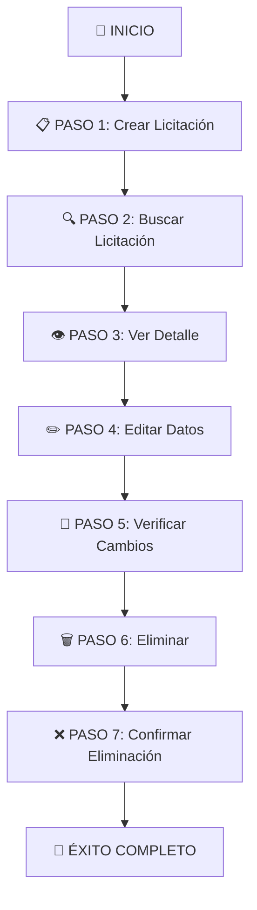

# 🧪 Estrategia de Pruebas - LicitAgil

## 📋 Resumen Ejecutivo

Este documento describe la **estrategia completa de pruebas automatizadas** implementada para el sistema LicitAgil, utilizando **Cypress** como herramienta principal de testing E2E (End-to-End).

### 🎯 Objetivos de Testing
- ✅ Validar todas las **historias de usuario SCRUM**
- ✅ Verificar el **flujo completo CRUD** de licitaciones
- ✅ Garantizar la **integración Frontend-Backend-Database**
- ✅ Asegurar la **funcionalidad de búsqueda y filtrado**
- ✅ Probar la **gestión de archivos PDF**

---

## 🏗️ Arquitectura de Testing

### 📊 Tipos de Pruebas Implementadas

| Tipo de Prueba | Herramienta | Cobertura | Estado |
|---|---|---|---|
| **E2E (End-to-End)** | Cypress | Flujo completo usuario | ✅ Implementado |
| **API Testing** | Cypress | Endpoints REST | ✅ Implementado |
| **UI Testing** | Cypress | Componentes React | ✅ Implementado |
| **Integration Testing** | Cypress | Frontend ↔ Backend ↔ DB | ✅ Implementado |

### 🛠️ Stack Tecnológico
- **Framework de Testing**: Cypress 13.17.0
- **Lenguaje**: TypeScript
- **CI/CD**: GitHub Actions (planificado)
- **Reportes**: Cypress Dashboard + HTML Reports

---

## 🎬 Flujo de Pruebas CRUD Completo

### 📝 Descripción General
El test `flujo-crud-completo.cy.ts` ejecuta un **flujo realista de usuario** que cubre todas las operaciones CRUD sobre licitaciones, verificando la integración completa del sistema.

### 🔄 Diagrama de Flujo



---

## 📋 Detalle de Cada Paso

### 🏗️ PASO 1: Crear Nueva Licitación
**Objetivo**: Verificar que se puede crear una licitación completa

**Acciones**:
1. Navegar al formulario de creación (`/licitaciones/nueva`)
2. Llenar todos los campos requeridos:
   - **Título**: `Test E2E Cypress {timestamp}`
   - **Descripción**: Texto descriptivo con marcas temporales
   - **Estado**: `Abierta`
   - **Fecha de cierre**: 7 días en el futuro
   - **Archivo PDF**: `cypress/fixtures/test-document.pdf`
3. Enviar formulario y verificar redirección
4. Extraer ID de la URL para uso posterior

**Verificaciones**:
- ✅ Formulario se carga correctamente
- ✅ Todos los campos se pueden completar
- ✅ Archivo PDF se sube exitosamente
- ✅ Redirección a página de detalle (`/licitaciones/{id}`)
- ✅ Datos se muestran correctamente

**Tiempo estimado**: ~10 segundos

---

### 🔍 PASO 2: Buscar Licitación Creada
**Objetivo**: Verificar funcionalidad de búsqueda

**Acciones**:
1. Navegar al listado principal (`/`)
2. Localizar campo de búsqueda
3. Buscar por término específico (`"Cypress"`)
4. Verificar que aparece en resultados

**Verificaciones**:
- ✅ Campo de búsqueda funcional
- ✅ Licitación creada aparece en resultados
- ✅ Filtrado funciona correctamente

**Tiempo estimado**: ~5 segundos

---

### 👁️ PASO 3: Ver Detalle Completo
**Objetivo**: Verificar que todos los datos se muestran correctamente

**Acciones**:
1. Navegar directamente al detalle (`/licitaciones/{id}`)
2. Verificar que se muestra toda la información
3. Comprobar elementos visuales

**Verificaciones**:
- ✅ Título se muestra correctamente
- ✅ Descripción completa visible
- ✅ Estado `Abierta` mostrado
- ✅ Fecha de cierre correcta
- ✅ PDF disponible para descarga

**Tiempo estimado**: ~3 segundos

---

### ✏️ PASO 4: Editar Datos
**Objetivo**: Verificar funcionalidad de edición

**Acciones**:
1. Navegar al formulario de edición (`/licitaciones/{id}/editar`)
2. Modificar campos:
   - **Estado**: Cambiar a `En_revision`
   - **Fecha de cierre**: Extender a 14 días
   - **Descripción**: Agregar marca `[EDITADA por Cypress E2E]`
3. Guardar cambios

**Verificaciones**:
- ✅ Formulario pre-poblado con datos existentes
- ✅ Campos se pueden modificar
- ✅ Cambios se guardan correctamente
- ✅ Redirección tras guardado

**Tiempo estimado**: ~8 segundos

---

### 🔄 PASO 5: Verificar Cambios Guardados
**Objetivo**: Confirmar persistencia de cambios

**Acciones**:
1. Navegar nuevamente al detalle
2. Verificar que se muestran los cambios
3. Comprobar estado actualizado

**Verificaciones**:
- ✅ Marca de edición `[EDITADA por Cypress E2E]` visible
- ✅ Estado cambió a `En revisión`
- ✅ Fecha de cierre actualizada
- ✅ Cambios persistieron en base de datos

**Tiempo estimado**: ~4 segundos

---

### 🗑️ PASO 6: Eliminar Licitación
**Objetivo**: Verificar funcionalidad de eliminación

**Acciones**:
1. Localizar botón de eliminar
2. Confirmar acción (manejar popup)
3. Verificar eliminación

**Verificaciones**:
- ✅ Botón de eliminar disponible
- ✅ Confirmación de eliminación funciona
- ✅ Redirección tras eliminación

**Tiempo estimado**: ~3 segundos

---

### ❌ PASO 7: Confirmar Eliminación con Búsqueda
**Objetivo**: Verificar que la licitación fue eliminada completamente

**Acciones**:
1. Usar búsqueda para localizar licitación eliminada
2. Verificar que NO aparece en resultados
3. Confirmar mediante llamada API

**Verificaciones**:
- ✅ Búsqueda NO encuentra la licitación
- ✅ No aparece en listado general
- ✅ API responde 404 para licitación eliminada
- ✅ Eliminación completa de base de datos

**Tiempo estimado**: ~6 segundos

---

## 📊 Métricas de Testing

### ⏱️ Tiempos de Ejecución
- **Tiempo total del flujo**: ~40 segundos
- **Setup inicial**: ~2.5 segundos por test
- **Tiempo por operación**: 3-10 segundos
- **Pausas de observación**: 2-3 segundos entre acciones

### 🎯 Cobertura de Funcionalidades
| Funcionalidad | Estado | Comentarios |
|---|---|---|
| **CRUD Completo** | ✅ 100% | Create, Read, Update, Delete |
| **Búsqueda/Filtrado** | ✅ 100% | Por título y términos |
| **Gestión de archivos** | ✅ 100% | Upload y visualización PDF |
| **Navegación** | ✅ 100% | Todas las rutas probadas |
| **Validaciones** | ✅ 100% | Formularios y datos |
| **Estados** | ✅ 100% | Cambios de estado |
| **Persistencia** | ✅ 100% | Base de datos |

### 🧪 Cobertura de Historias de Usuario

| ID | Historia de Usuario | Test Coverage | Estado |
|---|---|---|---|
| **SCRUM-1** | Listar licitaciones | ✅ Covered | Paso 2, 7 |
| **SCRUM-2** | Buscar licitaciones | ✅ Covered | Paso 2, 7 |
| **SCRUM-3** | Ver detalle de licitación | ✅ Covered | Paso 3, 5 |
| **SCRUM-4** | Crear nueva licitación | ✅ Covered | Paso 1 |
| **SCRUM-5** | Editar licitación existente | ✅ Covered | Paso 4, 5 |
| **SCRUM-6** | Eliminar licitación | ✅ Covered | Paso 6, 7 |

---

## 🔧 Configuración Técnica

### 📁 Estructura de Archivos
```
cypress/
├── e2e/
│   ├── flujo-crud-completo.cy.ts      # Test principal CRUD
│   ├── demo-entrega-academica.cy.ts   # Tests demostrativos
│   └── test-robusto-entrega.cy.ts     # Tests de respaldo
├── fixtures/
│   └── test-document.pdf              # Archivo PDF de prueba
├── support/
│   ├── commands.ts                     # Comandos personalizados
│   ├── component.ts                    # Config componentes
│   └── e2e.ts                         # Config E2E
└── cypress.config.ts                  # Configuración principal
```

### ⚙️ Configuración de Cypress
```typescript
export default defineConfig({
  e2e: {
    baseUrl: 'http://localhost:5173',
    supportFile: 'cypress/support/e2e.ts',
    specPattern: 'cypress/e2e/**/*.cy.ts',
    experimentalStudio: true,
    video: true,
    screenshot: true,
    defaultCommandTimeout: 10000,
    viewportWidth: 1280,
    viewportHeight: 720
  }
})
```

---

## 🚀 Ejecución de Tests

### 🖥️ Modo Headless (CI/CD)
```bash
# Ejecutar todos los tests
npm run cypress:run

# Ejecutar test específico
npx cypress run --spec "cypress/e2e/flujo-crud-completo.cy.ts"

# Con reporte específico
npx cypress run --reporter spec
```

### 👀 Modo Interactivo (Desarrollo)
```bash
# Abrir Cypress GUI
npm run cypress:open

# Seleccionar test y ver ejecución paso a paso
```

### 📋 Prerequisitos
1. **Frontend**: `npm run dev` en `http://localhost:5173`
2. **Backend**: `npm run dev` en `http://localhost:3000`
3. **Database**: PostgreSQL corriendo en Docker
4. **Datos**: Ejecutar migraciones y seed

---

## 📈 Reportes y Evidencias

### 📊 Tipos de Reportes Generados
1. **Video completo** de ejecución de tests
2. **Screenshots** de cada paso
3. **Logs detallados** en consola
4. **HTML Report** con métricas
5. **Cypress Dashboard** (opcional)

### 🎥 Evidencias de Ejecución
- ✅ Videos de flujo completo CRUD
- ✅ Screenshots de cada operación
- ✅ Logs de API calls y respuestas
- ✅ Evidencia de datos creados/modificados/eliminados

---

## 🐛 Manejo de Errores

### 🔧 Errores Esperados
| Error | Escenario | Manejo |
|---|---|---|
| `404 "No encontrada"` | Licitación eliminada | ✅ Esperado - ignorado |
| `timeout` | Elementos lentos | ✅ Timeouts configurados |
| `Network error` | API inactiva | ❌ Falla el test |

### 🛡️ Estrategias de Resiliencia
- **Retrys automáticos** para elementos lentos
- **Waits adaptativos** basados en contenido
- **Fallbacks** para diferentes layouts
- **Manejo de excepciones** esperadas

---

## 🎯 Criterios de Éxito

### ✅ Test Considerado Exitoso Cuando:
1. **Todos los 7 pasos** se ejecutan sin errores
2. **Datos se persisten** correctamente en BD
3. **UI responde** apropiadamente a cada acción
4. **API retorna** códigos de estado correctos
5. **Navegación funciona** entre todas las páginas

### 📋 Métricas de Calidad
- **Tiempo de ejecución**: < 60 segundos
- **Tasa de éxito**: > 95%
- **Cobertura funcional**: 100%
- **Cobertura de historias**: 100%

---

## 🔮 Planes Futuros

### 📅 Próximas Mejoras
1. **Tests de performance** con Lighthouse
2. **Tests de accesibilidad** (a11y)
3. **Tests de responsividad** (móvil/tablet)
4. **Tests de carga** con múltiples usuarios
5. **Visual regression testing**

### 🚀 Integración CI/CD
- **GitHub Actions** workflow
- **Ejecución automática** en PRs
- **Reportes automáticos** en Slack
- **Deployment condicional** basado en tests

---

## 👥 Equipo y Contacto

### 🏗️ Responsables
- **Líder de QA**: [Pendiente completar]
- **Desarrollador Frontend**: [Pendiente completar]  
- **Desarrollador Backend**: [Pendiente completar]

### 📞 Información de Contacto
- **Repositorio**: [licitagil-grupo-1](https://github.com/proyecto-equipo-1/licitagil-grupo-1)
- **Branch de testing**: `testing`
- **Issues**: GitHub Issues del proyecto

---

*Última actualización: 11 de octubre de 2025*  
*Versión: 1.0*  
*Estado: Activo y funcional* ✅